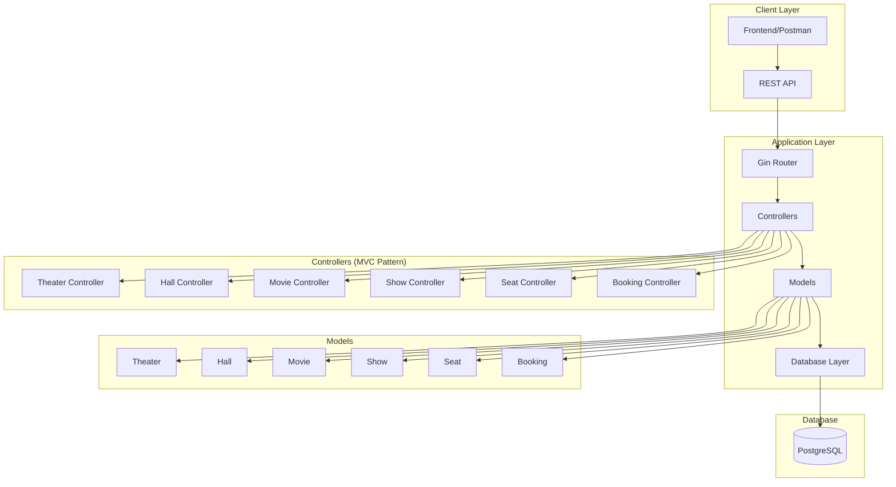
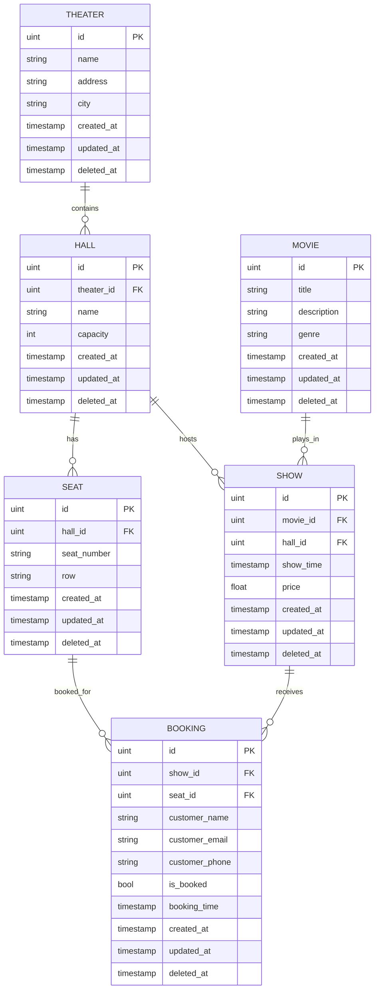

# BookMyGo - Movie Booking System

A comprehensive movie booking system built with Go, Gin framework, and PostgreSQL. This system provides a complete backend solution for managing theaters, movies, shows, and seat bookings with transaction-safe operations.

## 🏗️ Architecture Overview



## 🚀 Features

- **Theater Management**: Create and manage multiple theaters
- **Hall Management**: Configure halls within theaters with seating capacity
- **Movie Management**: Add, update, and manage movie catalog
- **Show Scheduling**: Schedule movies in specific halls with timing and pricing
- **Seat Management**: Automated seat generation for halls
- **Booking System**: Transaction-safe seat booking with race condition prevention
- **Availability Checking**: Real-time seat availability for shows
- **Booking Management**: View, cancel, and manage bookings

## 🛠️ Tech Stack

- **Backend**: Go (Golang)
- **Web Framework**: Gin
- **Database**: PostgreSQL
- **ORM**: GORM
- **Architecture**: MVC (Model-View-Controller)
- **Configuration**: Environment variables

## 📁 Project Structure

```
bookmygo/
├── cmd/
│   └── server/
│       └── main.go              # Application entry point
├── internal/
│   ├── config/
│   │   └── config.go            # Configuration management
│   ├── controllers/
│   │   ├── booking_controller.go    # Booking operations
│   │   ├── hall_controller.go       # Hall management
│   │   ├── movie_controller.go      # Movie operations
│   │   ├── seat_controller.go       # Seat management
│   │   ├── show_controller.go       # Show scheduling
│   │   └── theater_controller.go    # Theater management
│   ├── database/
│   │   ├── migrate.go           # Database migrations
│   │   └── postgres.go          # Database connection
│   ├── models/
│   │   ├── booking.go           # Booking model
│   │   ├── hall.go              # Hall model
│   │   ├── movie.go             # Movie model
│   │   ├── seat.go              # Seat model
│   │   ├── show.go              # Show model
│   │   └── theater.go           # Theater model
│   └── views/                   # (Reserved for future use)
├── routes/
│   └── routes.go                # API route definitions
├── go.mod                       # Go module file
├── go.sum                       # Go dependencies
└── README.md                    # Project documentation
```

## 🔗 Database Schema



## 🔧 Installation & Setup

### Prerequisites
- Go 1.19 or higher
- PostgreSQL 12 or higher
- Git

### Installation Steps

1. **Clone the repository**
   ```bash
   git clone https://github.com/ImKartikey27/bookMyGo.git
   cd bookmygo
   ```

2. **Install dependencies**
   ```bash
   go mod tidy
   ```

3. **Set up environment variables**
   Create a `.env` file in the root directory:
   ```env
   DB_HOST=localhost
   DB_PORT=5432
   DB_USER=your_username
   DB_PASSWORD=your_password
   DB_NAME=bookmygo
   SERVER_PORT=8080
   ```

4. **Create PostgreSQL database**
   ```bash
   createdb bookmygo
   ```

5. **Run the application**
   ```bash
   go run cmd/server/main.go
   ```

The server will start on `http://localhost:8080`

## 📚 API Documentation

### Base URL
```
http://localhost:8080/api/v1
```

### Theater Endpoints

| Method | Endpoint | Description |
|--------|----------|-------------|
| POST | `/theaters` | Create a new theater |
| GET | `/theaters` | Get all theaters |
| GET | `/theaters/:id` | Get theater by ID |
| PUT | `/theaters/:id` | Update theater |
| DELETE | `/theaters/:id` | Delete theater |

### Hall Endpoints

| Method | Endpoint | Description |
|--------|----------|-------------|
| POST | `/halls` | Create a new hall |
| GET | `/halls` | Get all halls |
| GET | `/halls/:id` | Get hall by ID |
| GET | `/halls/theater/:theaterId` | Get halls by theater |
| DELETE | `/halls/:id` | Delete hall |

### Movie Endpoints

| Method | Endpoint | Description |
|--------|----------|-------------|
| POST | `/movies` | Create a new movie |
| GET | `/movies` | Get all movies |
| GET | `/movies/:id` | Get movie by ID |
| PUT | `/movies/:id` | Update movie |
| DELETE | `/movies/:id` | Delete movie |

### Show Endpoints

| Method | Endpoint | Description |
|--------|----------|-------------|
| POST | `/shows` | Create a new show |
| GET | `/shows` | Get all shows |
| GET | `/shows/:id` | Get show by ID |
| GET | `/shows/movie/:movieId` | Get shows by movie |
| GET | `/shows/theater/:theaterId` | Get shows by theater |
| DELETE | `/shows/:id` | Delete show |

### Seat Endpoints

| Method | Endpoint | Description |
|--------|----------|-------------|
| POST | `/seats/hall/:hallId` | Create seats for a hall |
| GET | `/seats/hall/:hallId` | Get seats by hall |

### Booking Endpoints

| Method | Endpoint | Description |
|--------|----------|-------------|
| POST | `/bookings` | Create a new booking |
| GET | `/bookings/:id` | Get booking by ID |
| GET | `/bookings/show/:showId` | Get bookings by show |
| PUT | `/bookings/:id/cancel` | Cancel booking |
| GET | `/bookings/available-seats/:showId` | Get available seats for show |
| GET | `/bookings/check-availability` | Check seat availability |

## 🧪 Testing with Postman

### Sample Test Workflow

1. **Create Theater**
   ```json
   POST {{base_url}}/theaters
   {
     "name": "PVR Cinemas",
     "address": "123 Mall Road",
     "city": "Mumbai"
   }
   ```

2. **Create Hall**
   ```json
   POST {{base_url}}/halls
   {
     "name": "Screen 1",
     "theater_id": {{theater_id}},
     "capacity": 100
   }
   ```

3. **Create Seats**
   ```json
   POST {{base_url}}/seats/hall/{{hall_id}}
   {
     "rows": 10,
     "columns": 10
   }
   ```

4. **Create Movie**
   ```json
   POST {{base_url}}/movies
   {
     "title": "Avengers: Endgame",
     "description": "Epic superhero movie",
     "genre": "Action"
   }
   ```

5. **Create Show**
   ```json
   POST {{base_url}}/shows
   {
     "movie_id": {{movie_id}},
     "hall_id": {{hall_id}},
     "show_time": "2024-08-25T18:00:00Z",
     "price": 250.00
   }
   ```

6. **Check Available Seats**
   ```
   GET {{base_url}}/bookings/available-seats/{{show_id}}
   ```

7. **Book Seat**
   ```json
   POST {{base_url}}/bookings
   {
     "show_id": {{show_id}},
     "seat_id": 1,
     "customer_name": "John Doe",
     "customer_email": "john@example.com",
     "customer_phone": "9876543210"
   }
   ```

### Postman Collection

📄 **[Download Postman Collection](/Public/bookmygo.postman_collection.json)**

Complete collection with pre-configured requests, environment variables, and test scripts for comprehensive API testing.

## 👥 Authors

- **Kartikey Sangal** - *Initial work* - [ImKartikey27](https://github.com/ImKartikey27)

---

**Built with ❤️ using Go and Gin framework**